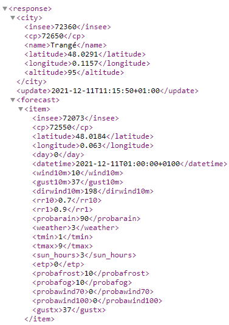
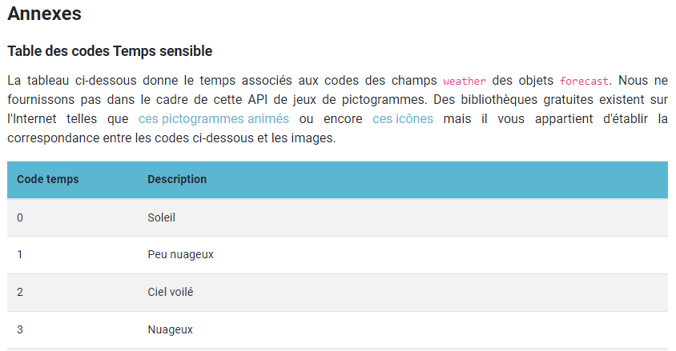

#Compte rendu du TP
        Réalisé par Aksel Vaillant - ENSIM 
        Lien du github - https://github.com/aksel-vaillant/java-api

##Etape 5 - Description des dépendances
- Spring web : permet de fournir une infrastructure pour compiler et construire un site web
- Spring data JPA : permet d'implémenter une couche d'accès aux données
- Hibernate validation : permet de créer les balises "form" pour le web
- H2 database : permet de créer en java une base de données dans la mémoire
- Spring devtools : permet d'améliorer l'DX (developer experience)
- Thymeleaf : permet de travailler dans des environnements web et en offline pour simuler un siteweb

##Etape 13 - Controller  

1 - URL d'appel  - @GetMapping("/greeting")  

2 - Sélection du fichier HTML - return "greeting";

3 - Remplacer la valeur par défaut à l'aide de l'annotation @RequestParam

##Etape 17 - H2  

La table Address a été ajoutée dans la BDD

##Etape 18 - Hibernate  

Hibernate est un framework open source gérant la persistance des objets en base de données relationnelle.
A l'aide de son système de notation, cela permet de modifier et manipuler les bases de données facilement à travers les objets java.

##Etape 20 - Requête data.sql
SELECT * FROM address  

On affiche toute la table address

##Etape 23  

@Autowired permet l'injection de dépendences pour pouvoir chercher l'interface AddressRepository, le service qui permet d'accéder à la base de donnée pour créer, lire, mettre à jour et supprimer les données

##Etape 30 - Ajout de Bootstrap  

    <dependency>
        <groupId>org.webjars</groupId>
        <artifactId>bootstrap</artifactId>
        <version>5.1.3</version>
    </dependency>

##Fin TP4  

###Faut-il une clé API pour appeler MeteoConcept ?  

Oui, il faut un jeton/token pour accéder aux bases de données de MeteoConcept.

###Quelle URL appeler ?  

    String uri = "https://api.meteo-concept.com/api/forecast/daily?" +
                "token=TOKEN&" +
                "latlng="+ lat +","+ lon;
Principalement composer de l'URL de l'api et la météo du jour. 
On ajoute en plus de cela le token pour s'identifier auprès du serveur.

###Quelle méthode HTTP utiliser ?  

Pour réaliser une requête à ces serveurs, on doit utiliser la méthode GET pour passer en paramètres des informations supplémentaires permettant d'affiner notre recherche/demande.

###Comment passer les paramètres d'appels ?  

En modifiant légèrement l'URL à appeler avec une concaténation d'éléments. On ajoute latlng - l'attribut permettant de décrire la latitude et la longitude du point GPS. 
Le reste de l'URL se trouve à la question "Quelle URL appeler".

###Où est l'information dont j'ai besoin dans la réponse

  
Exemple de réponse 

###Pour afficher la prévision de météo du lieu visé par les coordonnées GPS

Architecture : response>forecast>item[0]>weather  
Sélection de item[0] puisque c'est un tableau de item.  

  
Dans notre exemple et selon l'annexe fournit par MeteoConcept, une "weather" de valeur 3 signifie un temps nuageux.

###Pour afficher la température du lieu visé par les coordonnées GPS

Architecture : response>forecast>item[0]>tmin et response>forecast>item[0]>tmax  
Sélection des températures minimales et maximales